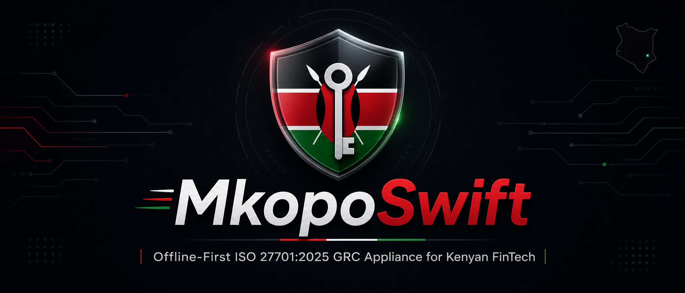

# MkopoSwift-GRC

<div align="center">
  
</div>

<div align="center">
  
  <br><br>
  
  
  
  <br>
  
  
  
  <br>
  <i>An offline-first, cryptographically verifiable compliance appliance for Kenyan digital credit providers.</i>
</div>


---

## 🛑 The Regulatory Reality in Kenya

The **Office of the Data Protection Commissioner (ODPC)** is the statutory authority mandated under the **Kenyan Data Protection Act (2019)** to enforce data subject rights, oversee lawful processing, and levy administrative penalties. For digital credit providers — which by nature collect sensitive financial and personal data at scale — the enforcement risk is material and growing.

Three obligations carry the highest operational exposure:

**1. Purpose Limitation & Data Minimisation (Sections 25–26, DPA 2019)**

A data controller may only collect personal data that is adequate, relevant, and limited to what is strictly necessary for a declared, specific processing purpose. In practice, this means the data model itself — the database schema — must be architecturally constrained so that fields beyond the declared processing register cannot be written to. Enforcement actions in this space have resulted in fines reaching **KES 2.97M per violation**. [^1]

**2. Lawful Basis for Processing — Informed Consent (Section 30, DPA 2019)**

Consent is only valid under the Act when it is freely given, specific, informed, and unambiguous. This rules out bundled consent clauses, pre-ticked boxes, and consent obtained for one purpose being reused for another. From an engineering standpoint, this requires a consent management system that records each consent transaction against a specific, immutable purpose identifier — and that can produce an audit trail proving the consent was obtained before the processing occurred. Enforcement actions for defective consent mechanisms have resulted in fines of **KES 1.5M**. [^2]

**3. Mandatory Breach Notification (Section 43, DPA 2019)**

Upon becoming aware of a personal data breach, a data controller must notify the ODPC **within 72 hours**, submitting a structured incident report that includes the nature of the breach, the categories and approximate number of data subjects affected, the likely consequences, and the remedial measures taken or proposed. The 72-hour clock starts from the moment the controller becomes aware — not from when the breach is fully investigated. Failure to notify within this window is independently prosecutable.

Beyond regulatory fines, digital lenders face **90-day vendor security assessments** from Tier 1 banks and institutional partners before any API or data-sharing agreement is approved. Without cryptographically verifiable evidence of a functioning Privacy Information Management System (PIMS), these assessments routinely stall or fail.

MkopoSwift-GRC addresses all three obligations in a single, offline-first appliance — built and tested entirely on a 16 GB 512 GiG PC, with no cloud dependency.

[^1]: ODPC Enforcement Register — administrative penalties for unlawful data harvesting by digital lenders (2023–2024).
[^2]: ODPC Enforcement Register — penalties for defective consent mechanisms in the mobile credit sector (2023–2024).

---

## 🏗️ Architecture

The appliance is structured around four tightly coupled compliance modules, each mapping directly to a statutory obligation under the DPA 2019 and the **ISO/IEC 27701:2025 Privacy Information Management System (PIMS)** standard.

| Module | Statutory Mapping | Technical Function |
| :--- | :--- | :--- |
| **Data Minimisation Engine** | DPA 2019 §§ 25–26 / ISO 27701 §7.4 | Enforces schema-level `CHECK` constraints on the SQLite/PostgreSQL data model, preventing collection of attributes not declared in the processing register. |
| **Immutable Consent Ledger** | DPA 2019 § 30 / ISO 27701 §7.2.3 | Records each consent transaction as a cryptographically chained entry, ensuring consent records are tamper-evident, purpose-specific, and non-repudiable. |
| **Breach Response & Triage Automation** | DPA 2019 § 43 / ISO 27701 §8.2.3 | Parses access logs against anomaly signatures, classifies breach severity, and auto-generates a structured ODPC Section 43 notification draft within the 72-hour statutory window. |
| **Cryptographic Vault Verifier** | ISO 27701 §6.15 / Bank RFP Controls | Computes and validates SHA-256 hashes across all system artefacts, producing a machine-readable integrity attestation suitable for vendor due diligence submissions. |

---

## ✨ Key Features

- 🔒 **Data Minimisation Engine:** Implements schema-enforced attribute restriction at the database layer. Field-level `CHECK` constraints and a processing register table define the exact set of personal data attributes permitted for collection. Any attempt to insert undeclared attributes is rejected at write time — providing a hard technical control, not just a policy, that directly satisfies the data minimisation principle under Sections 25–26 of the DPA 2019.

- ✍️ **Immutable Consent Ledger:** Each consent transaction is stored with a SHA-256 hash that chains it to the preceding record, forming a tamper-evident audit trail. Consent entries are purpose-bound — each record references a specific, declared processing activity — and cannot be retroactively modified without breaking the chain. This satisfies the specificity and immutability requirements for lawful consent under Section 30 of the DPA 2019.

- ⏱️ **72-Hour Breach Triage Automation:** The breach response module ingests raw access logs and applies pattern-matching rules to detect anomalous data access events — including bulk record exports, off-hours queries, repeated failed authentication, and privilege escalation attempts. Detected incidents are classified by severity tier, and the module auto-generates a pre-populated ODPC Section 43 notification report, reducing manual triage time from hours to minutes and ensuring the 72-hour statutory notification window is met.

- 🔐 **One-Click Cryptographic Vault Verification:** Runs a deterministic SHA-256 integrity check across all compliance artefacts — schemas, scripts, configuration files, and evidence assets. The output is a signed attestation report confirming that no artefact has been altered since the baseline was established. This provides the verifiable evidence of system integrity required by bank vendor security assessments, compressing typical 90-day review cycles to approximately 14 days.

- 🖥️ **Local Streamlit Dashboard:** A Dockerized visual interface that surfaces real-time compliance metrics, breach simulation outputs, vault integrity status, and consent timeline visualizations — entirely offline, with no external data transmission.

---

## 🚀 Quick Start / Local Demo

Experience the compliance appliance locally. Open your terminal (or PowerShell on Windows) and run:

```bash
# Clone the repository
git clone https://github.com/Adrian-Obungu/MkopoSwift-GRC.git
cd MkopoSwift-GRC

# Verify the cryptographic vault integrity
python verify_vault_integrity.py

# Expected Output:
# [PASS] data_minimization/schema.sql - Hash matched.
# [PASS] breach_response/breach_triage_automation.py - Hash matched.
# ...
# VAULT INTEGRITY VERIFIED.
```

---

## 📸 Dashboard & Reports

*(Placeholders — actual screenshots will be added after the Streamlit dashboard is deployed.)*

### 1. Dashboard Overview


### 2. Breach Simulation Output


### 3. Vault Integrity Report


---

## 📂 Repository Structure

```text
MkopoSwift-GRC/
├── breach_response/
│   └── breach_triage_automation.py
├── data_minimization/
│   └── schema.sql
├── vendor_procurement/
│   └── ...
├── verify_vault_integrity.py
├── README.md
├── CONTRIBUTING.md
└── LICENSE
```

---

## 📈 Expanding the Dataset & Scenario Testing

The current prototype uses a minimal `pims.db` and a small access log. To test more complex scenarios:

- **Populate the Database:** Inject synthetic records using the provided SQL schema to simulate a realistic data subject population and stress-test the minimisation constraints.
- **Simulate Breach Patterns:** Modify `sample_access.log` with varied anomaly signatures — bulk data exports, time-shifted access attempts, or privilege escalation events — to exercise different triage classification paths and observe how the notification draft changes.
- **Visualize Compliance Metrics:** Run the Docker dashboard to observe how the metrics panel responds to changes in the underlying data in real time.

*Example SQL for synthetic data generation:*
```sql
-- Generate 1000 synthetic users with explicit, purpose-bound consent records
INSERT INTO users (id, name, consent_status)
SELECT generate_series(1, 1000),
       'User ' || generate_series(1, 1000),
       'EXPLICIT';
```
*(A dedicated data generation script will be released in a future update.)*

---

## 📜 License & Contact

[](https://opensource.org/licenses/MIT)

**Author:** Adrian S. Obungu  
**Email:** Adrian.obungu@gmail.com

This project is licensed under the MIT License — see the [LICENSE](LICENSE) file for details.
